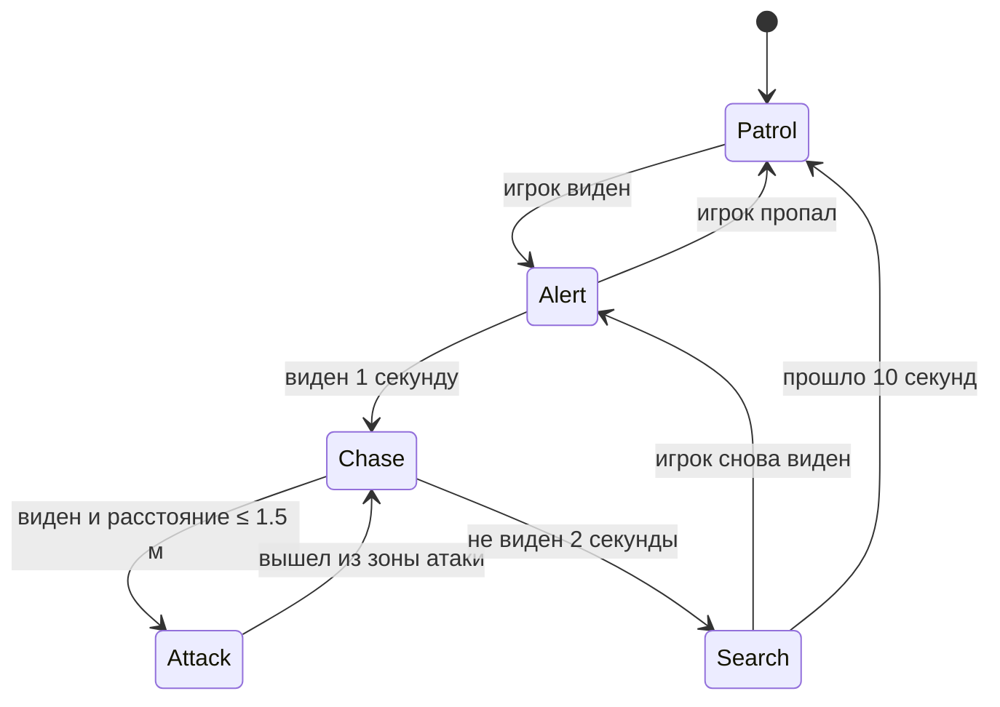
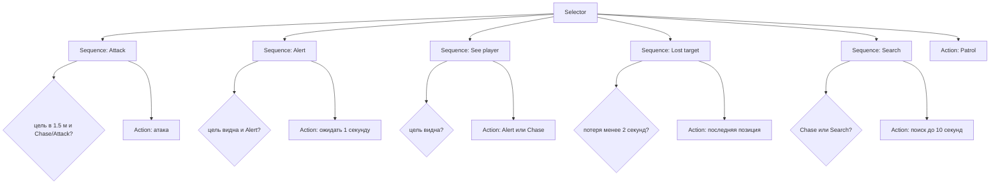

# Диаграммы поведения

## FSM

```mermaid
stateDiagram-v2
    [*] --> Patrol
    Patrol --> Alert: игрок виден
    Alert --> Patrol: игрок пропал
    Alert --> Chase: виден 1 секунду
    Chase --> Attack: виден и расстояние ≤ 1.5 м
    Attack --> Chase: вышел из зоны атаки
    Chase --> Search: не виден 2 секунды
    Search --> Alert: игрок снова виден
    Search --> Patrol: прошло 10 секунд
```

## Behavior Tree

```mermaid
flowchart TD
    R[Selector] --> A[Sequence: Attack]
    R --> B[Sequence: Alert]
    R --> C[Sequence: See player]
    R --> D[Sequence: Lost target]
    R --> E[Sequence: Search]
    R --> F[Action: Patrol]
    A --> A1{цель в 1.5 м и Chase/Attack?}
    A --> A2[Action: атака]
    B --> B1{цель видна и Alert?}
    B --> B2[Action: ожидать 1 секунду]
    C --> C1{цель видна?}
    C --> C2[Action: Alert или Chase]
    D --> D1{потеря менее 2 секунд?}
    D --> D2[Action: последняя позиция]
    E --> E1{Chase или Search?}
    E --> E2[Action: поиск до 10 секунд]
```
